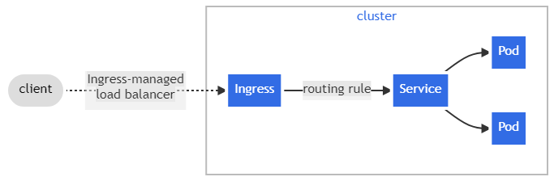

An API object that manages external access to the services in a cluster, typically HTTP.

Ingress may provide load balancing, SSL termination and name-based virtual hosting.

Ingress exposes HTTP and HTTPS routes from outside the cluster to services within the cluster. Traffic routing is controlled by rules defined on the Ingress resource.

Here is a simple example where an Ingress sends all its traffic to one Service:



You must have an Ingress controller to satisfy an Ingress. Only creating an Ingress resource has no effect.


### Features

* URL rewriting
* Authentication
* Rate limiting
* Canary deployments

```yaml
apiVersion: networking.k8s.io/v1
kind: Ingress
metadata:
  name: example-ingress
spec:
  rules:
  - host: myapp.example.com
    http:
      paths:
      - path: /api
        pathType: Prefix
        backend:
          service:
            name: api-service
            port: 
              number: 80
      - path: /
        pathType: Prefix
        backend:
          service:
            name: web-service
            port: 
              number: 80
```
[Good]
https://dev.to/vivekanandrapaka/istio-ingress-gateway-vs-istio-gateway-vs-kubernetes-ingress-5hgg