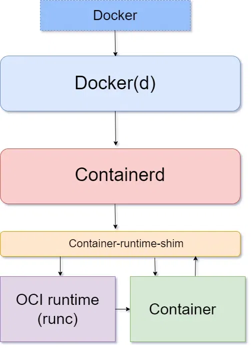

*The control plane is actually made up of several components:*

### kube-apiserver
This is the frontend server for the control plane, handling API requests.

### etcd
This is the database where Kubernetes stores all its information: what nodes exist, what resources exist on the cluster, and so on.

### kube-scheduler
This decides where to run newly created Pods.

### kube-controller-manager
This is responsible for running resource controllers, such as Deployments.

### cloud-controller-manager
This interacts with the cloud provider (in cloud-based clusters), managing resources such as load balancers and disk volumes.

Together, kube-apiserver, kube-controller-manager, kube-scheduler, and etcd form what is known as the control plane. The control plane is responsible for making decisions about the cluster, and pushing it toward the desired state. kube-apiserver, kube-controller-manager, and kube-scheduler are processes and etcd is a database; all four are run by the Kubernetes Master.

### Worker Node

#### Kublet
* It is mediator between master node(kube api server) and the worker node.
* Node administration
* Pod execution
* The Kubernetes Kubelet serves as the main node agent for all nodes, running in both the control plane and the worker plane.
* The Kubelet operates the deployment of pods to Kubernetes nodes. 
* It receives commands from the API server and informs the container runtime to start and stop containers as needed.

https://www.geeksforgeeks.org/what-is-kubelet-in-kubernetes/

### Container Run time Interface(CRI)
https://overcast.blog/understanding-and-using-kubernetes-container-runtime-79a88ab1661c

* The Container Runtime Interface (CRI) enables Kubernetes to support various container runtimes, such as Docker, containerd, and CRI-O, ensuring flexibility and extensibility. 

*  Traditionally, Docker was the go-to container runtime for Kubernetes. However, with the evolution of the Kubernetes ecosystem, Docker’s role has shifted. Kubernetes now uses Docker’s container runtime component, containerd, bypassing Docker's higher-level functionalities.

* `containerd`: Emerging as a core component in the container ecosystem, `containerd` manages the complete container lifecycle. It's optimized for simplicity and efficiency in Kubernetes environments.

