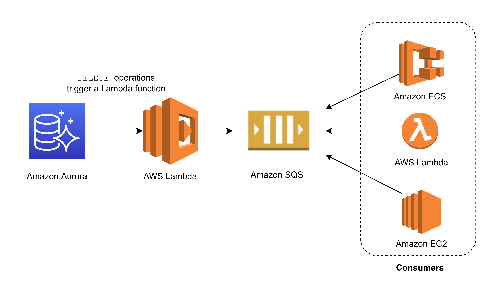

AWS Lambda supports many AWS services as event sources. For more information, see Using AWS Lambda with other services. When you configure these event sources to trigger a Lambda function, the Lambda function is invoked automatically when events occur. You define event source mapping, which is how you identify what events to track and which Lambda function to invoke.

### Lambda Use cases
https://docs.aws.amazon.com/lambda/latest/dg/applications-usecases.html

The first time you invoke your function, AWS Lambda creates an instance of the function and runs its handler method to process the event. When the function returns a response, it stays active and waits to process additional events. If you invoke the function again while the first event is being processed, Lambda initializes another instance, and the function processes the two events concurrently. As more events come in, Lambda routes them to available instances and creates new instances as needed. When the number of requests decreases, Lambda stops unused instances to free up the scaling capacity for other functions.

"Sudden Burst of Traffic" => API Gateway + Lambda

--------------------------------------------------------------------

AWS Lambda lets you run code without provisioning or managing servers. You pay only for the compute time you consume. With Lambda, you can run code for virtually any type of application or backend service - all with zero administration. Just upload your code, and Lambda takes care of everything required to run and scale your code with high availability. You can set up your code to automatically trigger from other AWS services or call it directly from any web or mobile app.

The first time you invoke your function, AWS Lambda creates an instance of the function and runs its handler method to process the event. When the function returns a response, it stays active and waits to process additional events. If you invoke the function again while the first event is being processed, Lambda initializes another instance, and the function processes the two events concurrently. As more events come in, Lambda routes them to available instances and creates new instances as needed. When the number of requests decreases, Lambda stops unused instances to free up the scaling capacity for other functions.

Your functions' concurrency is the number of instances that serve requests at a given time. For an initial burst of traffic, your functions' cumulative concurrency in a Region can reach an initial level of between 500 and 3000, which varies per Region.

Based on the given scenario, you need to create a solution that will satisfy the two requirements. The first requirement is to create a solution that will allow the users to access the data using an API. To implement this solution, you can use Amazon API Gateway. The second requirement is to handle the burst of traffic within seconds. You should use AWS Lambda in this scenario because Lambda functions can absorb reasonable bursts of traffic for approximately 15-30 minutes.

Lambda can scale faster than the regular Auto Scaling feature of Amazon EC2, Amazon Elastic Beanstalk, or Amazon ECS. This is because AWS Lambda is more lightweight than other computing services. Under the hood, Lambda can run your code to thousands of available AWS-managed EC2 instances (that could already be running) within seconds to accommodate traffic. This is faster than the Auto Scaling process of launching new EC2 instances that could take a few minutes or so. An alternative is to overprovision your compute capacity but that will incur significant costs. The best option to implement given the requirements is a combination of AWS Lambda and Amazon API Gateway.

----------------------------------------------------

You can invoke an AWS Lambda function from an Amazon Aurora MySQL-Compatible Edition DB cluster with a native function or a stored procedure. This approach can be useful when you want to integrate your database running on Aurora MySQL with other AWS services. For example, you might want to capture data changes whenever a row in a table is modified in your database.

