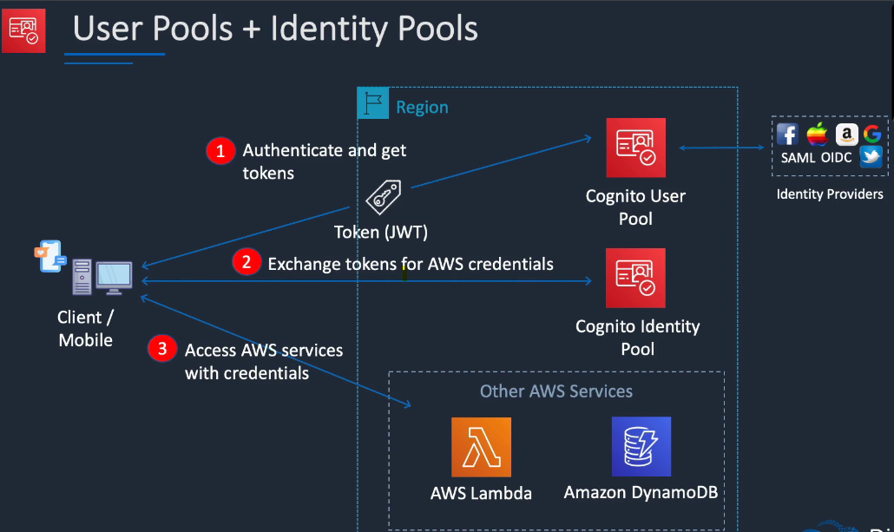

### AWS Directory Service
    AWS Directory Service provides multiple ways to use Microsoft Active Directory (AD) with other AWS services.

### Identity Providers and Federation

### IAM Identity Centers

    AWS IAM Identity Center is the recommended AWS service for managing human user access to AWS resources. It is a single place where you can assign your workforce users, also known as workforce identities, consistent access to multiple AWS accounts and applications.

    With IAM Identity Center, you can create or connect workforce users and centrally manage their access across all their AWS accounts and applications. You can use multi-account permissions to assign your workforce users access to AWS accounts. You can use application assignments to assign your users access to AWS managed and customer managed applications.

    Manage workforce identities
        Human users who build or operate workloads in AWS are also known as workforce users, or workforce identities. Workforce users are employees or contractors who you allow to access AWS accounts in your organization and internal business applications. These individuals might be developers who build your internal and customer-facing systems, or users of internal database systems and applications. You can create workforce users and groups in IAM Identity Center, or connect and synchronize to an existing set of users and groups in your own identity source for use across all your AWS accounts and applications

    Manage instances of IAM Identity 
        IAM Identity Center supports two types of instances: organization instances and account instances. An organization instance is the best practice. It's the only instance that enables you to manage access to AWS accounts and it's recommended for all production use of applications. 
    
    Manage access to multiple AWS accounts

    Manage access to applications

    https://docs.aws.amazon.com/singlesignon/latest/userguide/what-is.html
    https://aws.amazon.com/blogs/security/aws-federated-authentication-with-active-directory-federation-services-ad-fs/

### Amazon Cognito user pools
    Sign In And Sign up features
    Identities are in the user pool
    Provides JWT token

    

    Amazon Cognito can be used to federate mobile user accounts and provide them with their own IAM permissions, so they can be able to access their own personal space in the S3 bucket.

    Amazon Cognito lets you add user sign-up, sign-in, and access control to your web and mobile apps quickly and easily. Amazon Cognito scales to millions of users and supports sign-in with social identity providers, such as Apple, Facebook, Google, and Amazon, and enterprise identity providers via SAML 2.0 and OpenID Connect.

### Encryption
    Asymetric
    Symetric
    Encryption at Transtion and encryp. at Rest 

### KMS (Key Management Service)

    Customer managed

    AWS Managed
        The KMS keys that you create are customer managed keys. AWS services that use KMS keys to encrypt your service resources often create keys for you. KMS keys that AWS services create in your "AWS account" are AWS managed keys. KMS keys that AWS services create in a "service account" are AWS owned keys.
    AWS owned
        AWS owned keys are a collection of KMS keys that an AWS service owns and manages for use in multiple AWS accounts. Although AWS owned keys are not in your AWS account, an AWS service can use an AWS owned key to protect the resources in your account.

    https://docs.aws.amazon.com/kms/latest/developerguide/concepts.html#key-mgmt

    Key policy
    - In order that one can use KMS key, one should have key policy. IAM policies will itself has no effect to allow to use.
    - Though you can use IAM policy to deny permission to KMS key

### Server Side Encryption with AWS KMS Managed Keys (SSE-KMS) (When Customer wants control over Key)

 
Customer managed CMKs are CMKs in your AWS account that you create, own, and manage. You have full control over these CMKs, including establishing and maintaining their key policies, IAM policies, and grants, enabling and disabling them, rotating their cryptographic material, adding tags, creating aliases that refer to the CMK, and scheduling the CMKs for deletion.

### System Manager Parameter Store

Problem: It is required that, aws lambda need to authenticate to RDS using credentials.

Answer: In this case the scenario requires that credentials are used for authenticating to MySQL. The credentials need to be securely stored outside of the function code. *Systems Manager Parameter Store* provides secure, hierarchical storage for configuration data management and secrets management.

Other way to authenticate using IAM role - AWSAuthenticationPlugin.
 This is a great way to securely authenticate to RDS using IAM users or roles.

### AWS CloudHSM
    It's a hardware device.
    Cloud based hardware security module.
    Provide good protection to private key store.

    This is single tenant, and KMS is multi tenant

### WAF
    Monitor requests that are forwarded to API gateway, cloud front, or ALB
    Protect resources based on conditions like IP addresses

### Amazon Inspector
    Checks for security vulnerabilities
    EC2
    Network
    Host

### Amazon Macie
    Detect Sensitive Data on S3 using machine learning and pattern matching

### AWS Guard Duty
    Threat detection service
    Event monitoring

### AWS Shield
    DDOS attacks
    Protect and monitoring
    Standard comes by default with cloud front service

    For higher levels of protection against attacks targeting your applications running on Amazon Elastic Compute Cloud (EC2), Elastic Load Balancing(), Amazon CloudFront, and Amazon Route 53 resources, you can subscribe to AWS Shield Advanced. In addition to the network and transport layer protections that come with Standard, AWS Shield Advanced provides additional detection and mitigation against large and sophisticated DDoS attacks, near real-time visibility into attacks, and integration with AWS WAF, a web application firewall.

    AWS Shield Advanced also gives you 24x7 access to the AWS DDoS Response Team (DRT) and protection against DDoS related spikes in your Amazon Elastic Compute Cloud (EC2), Elastic Load Balancing(ELB), Amazon CloudFront, and Amazon Route 53 charges.

### Defence in Depth
    Security at multi levels
    

