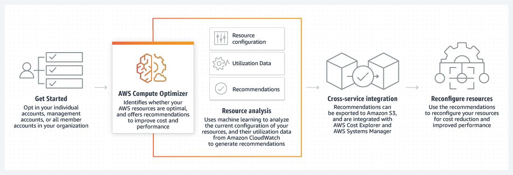
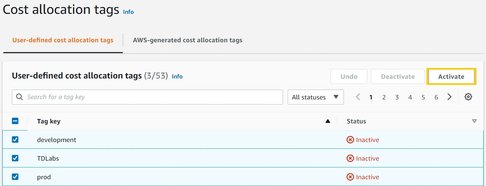

### Amplify and AppSync
  * Amplify:  Tool for building Full stack apps. Build and host both.
  * AppSync: GraphQL managed service. Creates a Unified API Layer for integrating the microservices

### Aws Device Farm
    Allow to test web and mobile app
    View in Desktop browsers/tablets/mobile
    Automate testing
    Gestures and swipe via remote access

### ML: SageMaker

https://www.udemy.com/course/aws-certified-solutions-architect-associate-hands-on/learn/lecture/33134038

### What is AWS Compute Optimizer?

* AWS Compute Optimizer is a service that analyzes the configuration and utilization metrics of your AWS resources. It reports whether your resources are optimal, and generates optimization recommendations to reduce the cost and improve the performance of your workloads. 

* Compute Optimizer also provides graphs showing recent utilization metric history data, as well as projected utilization for recommendations, which you can use to evaluate which recommendation provides the best price-performance trade-off. 

* Using machine learning to analyze historical utilization metrics. AWS Compute Optimizer provides a set of APIs and a console experience to help you reduce costs and increase workload performance by recommending the optimal AWS resources for your AWS workloads.

- Utlization metrics analysis
- Graphs
- Recommendations

### Cost Explorer

Billing Dashboard => Cost explorer

https://www.udemy.com/course/aws-certified-solutions-architect-associate-hands-on/learn/lecture/38494378

### AWS Price List Api

AWS Price List provides a catalog of the products and prices for AWS services that you can purchase on AWS.

Sends notification via SNS

* Author suggest to explore it before sit in exam.

AWS Price List Query API

This API provides a centralized and convenient way to programmatically query AWS for services, products, and pricing information.

### Cost and Usage report
This report is based on AWS services

* You can receive reports that break down your costs by the hour, day, or month, by product or product resource, or by tags that you define yourself. AWS updates the report in your bucket once a day in comma-separated value (CSV) format

* AWS Cost and Usage Reports tracks your AWS usage and provides estimated charges associated with your account. Each report contains line items for each unique combination of AWS products, usage type, and operation that you use in your AWS account. You can customize the AWS Cost and Usage Reports to aggregate the information either by the hour, day, or month.

AWS Cost and Usage Reports can do the following:

- Deliver report files to your Amazon S3 bucket

- Update the report up to three times a day

- Create, retrieve, and delete your reports using the AWS CUR API Reference

### AWS Cost Explorer 
  Forcasting and estimation
  It lets you filter spending and usage by Resource. You only track EC2 instances

  On the Cost Explorer dashboard, Cost Explorer shows your estimated costs for the month to date, your forecasted costs for the month, a graph of your daily costs, your five top cost trends, and a list of reports that you recently viewed.

### AWS Budgets
 AWS Budgets allows you to be alerted and run custom actions if your budget thresholds are exceeded.

 ### Tagging Resources / Cost Allocation Tags (by Department)
 Tag resources with the department name and enable cost allocation tags.

 A tag is a label that you or AWS assigns to an AWS resource. Each tag consists of a key and a value. For each resource, each tag key must be unique, and each tag key can have only one value. You can use tags to organize your resources and cost allocation tags to track your AWS costs on a detailed level.

After you or AWS applies tags to your AWS resources (such as Amazon EC2 instances or Amazon S3 buckets) and you activate the tags in the Billing and Cost Management console, AWS generates a cost allocation report as a comma-separated value (CSV file) with your usage and costs grouped by your active tags. You can apply tags that represent business categories (such as cost centers, application names, or owners) to organize your costs across multiple services.

