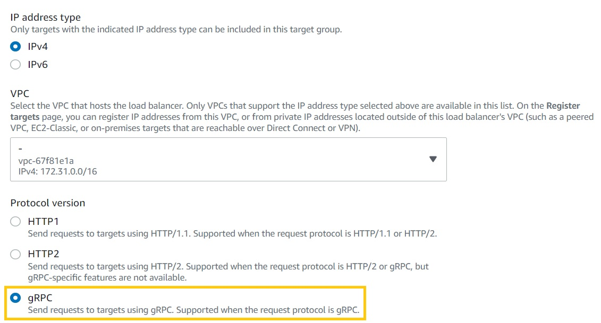

### Types of load balancers
- ALB
    - Normal web apps
- NLB
    - Used for application that operates on UDP, TCP 
    - Ultra low latency
- Gateway Load balancer
    - Used for applinaces

https://aws.amazon.com/compare/the-difference-between-the-difference-between-application-network-and-gateway-load-balancing/

### Create Autoscale Group

You need to create a Launch template first

Select AMI
Instance Type
Security Group
Insert User data, your script which will execute when instance starts

Create Autoscale Group
    Give group Name
    Choose AZ's. Choose multiple Az's
    Specify min and max of instance

As soon as your create ASG, go to instaces and check instances are running
Here ASG created two instances in two diff AZ's

### Autoscaling policy of ECS container
- Create an AWS Auto Scaling policy that scales out the ECS service when the service’s memory utilization is too high.
- Create an AWS Auto Scaling policy that scales out the ECS cluster when the service’s CPU utilization is too high.

### Target Groups

You select the runnning instaces and add to target group

Target groups route requests to individual registered targets, such as EC2 instances, using the protocol and port number that you specify. You can register a target(Ec2) with multiple target groups. You can configure health checks on a per target group basis. Health checks are performed on all targets registered to a target group that is specified in a listener rule for your load balancer.

Each target group is used to route requests to one or more registered targets. When you create each listener rule, you specify a target group and conditions. When a rule condition is met, traffic is forwarded to the corresponding target group. You can create different target groups for different types of requests. For example, create one target group for general requests and other target groups for requests to the microservices for your application. You can use each target group with only one load balancer.

https://docs.aws.amazon.com/elasticloadbalancing/latest/application/load-balancer-target-groups.html

A NLB was created by the author, and linked the Target group to the NLB created

Created Two Targetted Groups
- TL-ALB
- TL-NLB

Author Dis-associate the instances from target group ALB and attached it to ASG

Target group has to be attached to load balancer and rules need to be set at ALB for routing

### ALB - Query String Routing

When query string is A route to TG - ALB 

When query string is B route to TG - ALB 2

These rules were added to the ALB

Application Load Balancer operates at the request level (layer 7), routing traffic to targets (EC2 instances, containers, IP addresses, and Lambda functions) based on the content of the request. Ideal for advanced load balancing of HTTP and HTTPS traffic,

If your application is composed of several individual services, an Application Load Balancer can route a request to a service based on the content of the request such as Host field, Path URL, HTTP header, HTTP method, Query string, or Source IP address.

ALBs can also route and load balance gRPC traffic between microservices or between gRPC-enabled clients and services. This will allow customers to seamlessly introduce gRPC traffic management in their architectures without changing any of the underlying infrastructure on their clients or services.

### Scaling Policies
- Dynamic Scaling
- Scheduled Scaling

Author created dynamic scaling policy, that whenever CPU utilization increases above 70%, it should scale
The max capacity set to 6, the desired capacity is 2

Then he does stress testing. He used 'stress' package, and monitored on Cloud watch for CPU utilization.

This is target based scaling policy, other types are simple scaling policy and step scale policy

If you want to make sure that each AZ must have to run 2 instances and there are 2 AZ, then set min and desired capacity to 4.

https://stackoverflow.com/questions/64329133/auto-scaling-instances-in-multi-az-environment
(See 2nd ans)

### Sticky Sessions

### Secure listeners
SSL communication

Client ----- ALB ---- Instance
        C1        C2

To ensure both channels are encrypted, download the SSL certi at ALB and Instance both.

Things are different in NLB

Author gave demo of it, by registering a domain through Route53 service and registering a SSL certificate.

Important Lesson, but its ok to skip for re watch

Exams Cram re watch, Arch patterns re-watch plus do research on it.

https://docs.aws.amazon.com/autoscaling/ec2/userguide/autoscaling-load-balancer.html
https://aws.amazon.com/rds/features/multi-az/

