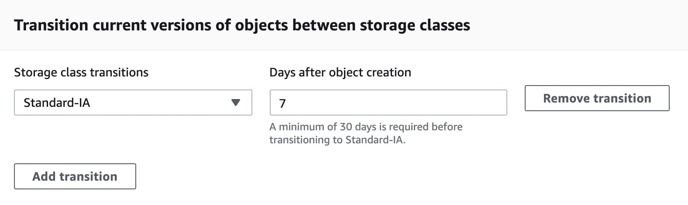

Amazon S3 is a simple key-based object store.

Alternatively, you can use S3 Object Tagging to organize your data across all your S3 buckets and/or prefixes.

Files can be from 0 bytes to 5TB.

For objects larger than 100 megabytes use the Multipart Upload capability.

Notifications can be sent to:

    SNS Topics.
    SQS Queue.
    Lambda functions.
    Need to configure SNS/SQS/Lambda before S3.
    No extra charges from S3 but you pay for SNS, SQS and Lambda.

S3 is Now Strongly Consistent
Effective immediately, all S3 GET, PUT, and LIST operations, as well as operations that change object tags, ACLs, or metadata, are now strongly consistent. What you write is what you will read, and the results of a LIST will be an accurate reflection of what’s in the bucket. This applies to all existing and new S3 objects, works in all regions, and is available to you at no extra charge! There’s no impact on performance, you can update an object hundreds of times per second if you’d like, and there are no global dependencies

# Imp Points
* You can only store files (objects) on S3.
* Amazon S3 automatically scales to high request rates.
* For read intensive requests you can also use CloudFront edge locations to offload from S3.
* 100 buckets per account by default.
* You can store unlimited objects in your buckets.
* You cannot create nested buckets.
* Objects stored in a bucket will never leave the region in which they are stored unless you move them to another region or enable cross-region replication.

S3 data is made up of:

    Key (name).
    Value (data).
    Version ID.
    Metadata.
    Access Control Lists.

# Storage Classes
There are six S3 storage classes.

- S3 Standard (durable, immediately available, frequently accessed).
- S3 Intelligent-Tiering (automatically moves data to the most cost-effective tier).
    (When company does not know how often a data will be accessed, or which data will be accessed most, and Architect needs to maintain the cost optimized)

- S3 Standard-IA (durable, immediately available, infrequently accessed).
- S3 One Zone-IA (lower cost for infrequently accessed data with less resilience).

- S3 Glacier (archived data, retrieval times in minutes or hours).
- S3 Glacier Deep Archive (lowest cost storage class for long term retention).

-------

### Storing logs for processing job for 24 hours
A team are planning to run analytics jobs on log files each day and require a storage solution. The size and number of logs is unknown and data will persist for 24 hours only.

S3 standard is the best choice in this scenario for a short term storage solution. In this case the size and number of logs is unknown and it would be difficult to fully assess the access patterns at this stage. Therefore, using S3 standard is best as it is cost-effective, provides immediate access, and there are no retrieval fees or minimum capacity charge per object.

If it is infrequent or usage are unknown then S3 Intelligent-Tiering is good.

-------

Storage Class Analysis
    Analyzes storage access patterns to help you decide when to transition the right data to the right storage class.

    Each object in Amazon S3 has a storage class associated with it. For example, if you list the objects in an S3 bucket, the console shows the storage class for all the objects in the list. Amazon S3 offers a range of storage classes for the objects that you store. You choose a class depending on your use case scenario and performance access requirements. All of these storage classes offer high durability.

    ==> Though there is no minimum duration when storing data in S3 Standard, you cannot transition to Standard IA within 30 days. This can be seen when trying to create a lifecycle rule
    

    ==> One zone IA is cheaper but offers lower availability. So if objects are required to be immediately available, then Standard IA is the right choice.

Storage Lens
    Delivers organization-wide visibility into object storage usage, activity trends, and makes actionable recommendations to improve cost-efficiency and apply data protection best practices.

S3 Object Lambda

### Types of store
Persistent data store
    S3, Glacier, EBS, EFS

Transient Data Store
    SQS, SNS

Ephemeral Data Store
    EC2 Instance Store, Memcached (Elasticache)

* What type of consistency model is provided in Amazon S3 when you upload a new version of an object?
- You get strong read after write consistency for all applications. You used to only get eventual consistency, but AWS made an update in late 2020.

### Setting the storage class of an object

* When creating a new object, you can specify its storage class. For example, when creating objects by using the PUT Object, POST Object, and Initiate Multipart Upload API operations, you add the x-amz-storage-class request header to specify a storage class. If you don't add this header, Amazon S3 uses S3 Standard, the default storage class.

* You can also change the storage class of an object that is already stored in Amazon S3 to any other storage class by making a copy of the object by using the PUT Object - Copy API operation.

* It is possible to specify storage class in upload request (PUT Object, POST Object, and Initiate Multipart Upload) via x-amz-storage-class header.

Additionally, if you want to enforce some storage classes in a bucket, you can do this via Bucket Policy (with s3:x-amz-storage-class condition key). This way any attempt to upload object with prohibited classes would fail.

https://docs.aws.amazon.com/AmazonS3/latest/userguide/storage-class-intro.html#sc-howtoset

https://stackoverflow.com/questions/20064275/how-to-change-default-storage-class-on-aws-s3?rq=3

aws s3 cp glacier.png s3://my-lambada-example-thumbnails/ --storage-class STANDARD_IA
