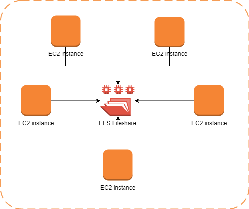

### EFS
    - You connect multiple EC2 instance to network file system
    - EC2 instances can be in diff AZ, within one VPC
    - If EC2 is in diff VPC then, you have to use VPC peering
    - Cross region also you can connect with VPC peering
    - Cross region, you can access it by IP addr, no DNS

Amazon Elastic File System (Amazon EFS) provides a simple, scalable, fully managed elastic NFS file system for use with AWS Cloud services and on-premises resources. It is built to scale on demand to petabytes without disrupting applications, growing and shrinking automatically as you add and remove files, eliminating the need to provision and manage capacity to accommodate growth.

- NFS protocol is used to mount the file system
-  You can use an EFS file system as a common data source for workloads and applications running on multiple instances

- You can control access to files and directories with POSIX-compliant user and group-level permissions.
- POSIX (group and user) permissions

* For Windows-based workflows with frequently accessed data, FSx for Windows is the best choice due to its performance, integration, and scalability.

* For cold storage of large datasets or infrequently accessed data, EFS is a more cost-effective option.

& For hybrid cloud storage requirements with mixed access patterns, File Gateway provides flexibility and data caching capabilities.

### 64,000 IOPS 

Amazon EC2 Nitro-based systems are not required for this solution but do offer advantages in performance that will help to maximize the usage of the EBS volume. For the data storage volume an i01 volume can support up to 64,000 IOPS so a single volume with sufficient capacity (50 IOPS per GiB) can be deliver the requirements.

https://docs.aws.amazon.com/AWSEC2/latest/UserGuide/AmazonEFS.html

----------

This particular scenario tests your understanding of EBS, EFS, and S3. In this scenario, there is a fleet of On-Demand EC2 instances that store file documents from the users to one of the attached EBS Volumes. The system performance is quite slow because the architecture doesn't provide the EC2 instances parallel shared access to the file documents.

Although an EBS Volume can be attached to multiple EC2 instances, you can only do so on instances within an availability zone. What we need is high-available storage that can span multiple availability zones. Take note as well that the type of storage needed here is "file storage" which means that S3 is not the best service to use because it is mainly used for "object storage", and S3 does not provide the notion of "folders" too. This is why using EFS is the correct answer.

* EC2 instances in multiple AZ is the key point here.