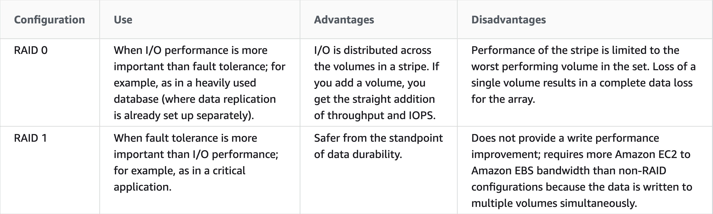

### RAID

A RAID array uses multiple EBS volumes to improve performance or redundancy. When fault tolerance is more important than I/O performance a RAID 1 array should be used which creates a mirror of your data for extra redundancy.

