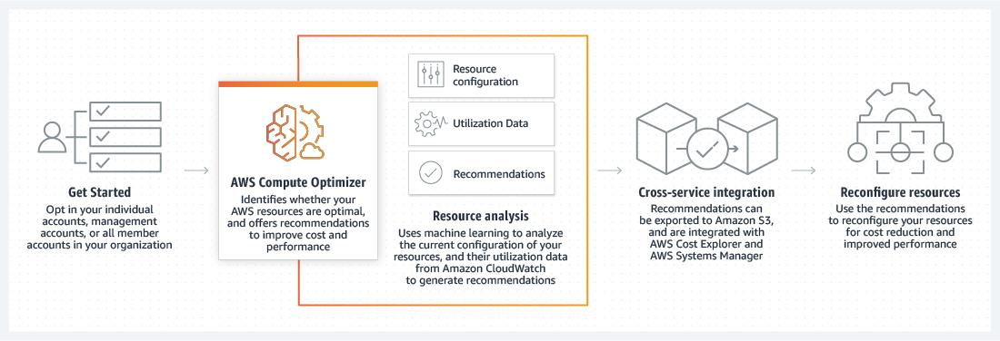

### Amplify and AppSync
  * Amplify:  Tool for building Full stack apps. Build and host both.
  * AppSync: GraphQL managed service. Creates a Unified API Layer for integrating the microservices

### Aws Device Farm
    Allow to test web and mobile app
    View in Desktop browsers/tablets/mobile
    Automate testing
    Gestures and swipe via remote access

### ML: SageMaker

https://www.udemy.com/course/aws-certified-solutions-architect-associate-hands-on/learn/lecture/33134038

### What is AWS Compute Optimizer?

* AWS Compute Optimizer is a service that analyzes the configuration and utilization metrics of your AWS resources. It reports whether your resources are optimal, and generates optimization recommendations to reduce the cost and improve the performance of your workloads. 

* Compute Optimizer also provides graphs showing recent utilization metric history data, as well as projected utilization for recommendations, which you can use to evaluate which recommendation provides the best price-performance trade-off. 

* Using machine learning to analyze historical utilization metrics. AWS Compute Optimizer provides a set of APIs and a console experience to help you reduce costs and increase workload performance by recommending the optimal AWS resources for your AWS workloads.

### Cost Explorer

Billing Dashboard => Cost explorer

https://www.udemy.com/course/aws-certified-solutions-architect-associate-hands-on/learn/lecture/38494378

### AWS Price List Api
    Sends notification via SNS

* Author suggest to explore it before sit in exam.
