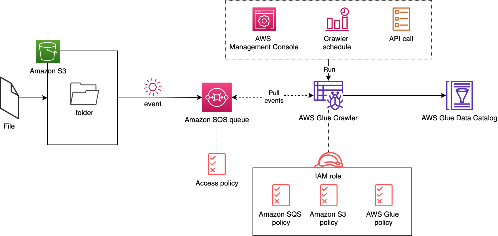

### AWS Guard Duty

An intelligent "threat detection service". It analyzes billions of events across your AWS accounts from AWS CloudTrail (AWS user and API activity in your accounts), Amazon VPC Flow Logs (network traffic data), and DNS Logs (name query patterns).

GuardDuty uses a combination of anomaly detection, machine learning, and continuously updated threat intelligence.
Monitors malicious or unauthorized behaviour

Can be setup in just few clicks
Continoiusly analyze
Intelligntly detect threats (apply rule sets and ML)
Can trigger AWS lambda for automated remediation or prevention

### AWS Macie

A security service that uses machine learning to automatically discover, classify, and protect sensitive data in AWS. 
Macie recognizes sensitive data such as personally identifiable information (PII) or intellectual property.

Amazon Macie allows you to achieve the following:
  * Identify and protect various data types, including PII, PHI, regulatory documents, API keys, and secret keys
  * Verify compliance with automated logs that allow for instant auditing
  * Identify changes to policies and access control lists
  * Receive notifications when data and account credentials leave protected zones
  * Detect when large quantities of business-critical documents are shared internally and externally
  * Prevents data loss

Data source can be CloudTrail or S3 objects

### AWS Inspector

An automated security assessment service that helps you test the network accessibility of your EC2 instances and the security state of your applications running on the instances.
Inspector uses IAM service-linked roles.

   - EC2
   - Network
   - Host

### AWS Glue

AWS Glue is a powerful ETL service that easily moves data between different data stores. By using AWS Glue, you can easily create and manage ETL jobs to transfer data from various sources, such as Amazon S3, Amazon RDS, and Amazon Redshift. Additionally, AWS Glue enables you to transform your data as needed to fit your specific needs. One of the key advantages of AWS Glue is its automatic schema discovery and mapping, which allows you to easily map data from different sources with different schemas.

Job Bookmarking
One of the features that make AWS Glue especially useful is job bookmarking. Job bookmarking is a mechanism that allows AWS Glue to keep track of where a job is left off in case it gets interrupted or fails for any reason. This way, when the job is restarted, it can pick up from where it left off instead of starting from scratch.

### AWS Secret Manager

AWS Secret Manager is a tool to securely store and collect sensitive information, such as database passwords and API keys.

By using AWS Secret Manager and a new AWS KMS key, you can ensure that your EKS cluster's etcd key-value store is secure and your sensitive data is protected.

By using AWS Secret Manager with a new AWS KMS key, you can add an extra layer of security to your EKS cluster's etcd key-value store. 

### AWS Config

To detect non complaint tags on AWS resources
Desired configuration setting on AWS resources

Usecase:- To check IAM access keys rotation after certain days.
You can create event bridge rule that triggers lambda function that deletes such IAM keys

### Amazon Comprehend
Amazon Comprehend Medical is a natural language processing service that makes it easy to use machine learning to extract relevant medical information from unstructured text. Using Amazon Comprehend Medical, you can quickly and accurately gather information, such as medical conditions, medication, dosage, strength, and frequency from a variety of sources, like doctors’ notes, clinical trial reports, and patient health records.

You access Comprehend Medical through a simple API call, no machine learning expertise is required, no complicated rules to write, and no models to train.

You can use the extracted medical information and their relationships to build applications for use cases, like clinical decision support, revenue cycle management (medical coding), and clinical trial management. Because Comprehend Medical is HIPAA-eligible and can quickly identify protected health information (PHI), such as name, age, and medical record number, you can also use it to create applications that securely process, maintain, and transmit PHI.

### When SAML not supported
If your identity store is not compatible with SAML 2.0 then you can build a custom identity broker application to perform a similar function. The broker application authenticates users, requests temporary credentials for users from AWS, and then provides them to the user to access AWS resources.

The application verifies that employees are signed into the existing corporate network's identity and authentication system, which might use LDAP, Active Directory, or another system. The identity broker application then obtains temporary security credentials for the employees.

### NAT
You can use a network address translation (NAT) gateway to enable instances in a private subnet to connect to the internet or other AWS services but prevent the internet from initiating a connection with those instances. You are charged for creating and using a NAT gateway in your account.

###  Application Migration Service
AWS Application Migration Service (AWS MGN) is the primary migration service recommended for lift-and-shift migrations to AWS. AWS encourages customers who are currently using AWS Elastic Disaster Recovery to switch to AWS MGN for future migrations. AWS MGN enables organizations to move applications to AWS without having to make any changes to the applications, their architecture, or the migrated servers.

AWS Application Migration Service minimizes time-intensive, error-prone manual processes by automatically converting your source servers from physical, virtual machines, and cloud infrastructure to run natively on AWS.

Implementation begins by installing the AWS Replication Agent on your source servers. When you launch Test or Cutover instances, AWS Application Migration Service automatically converts your source servers to boot and runs natively on AWS.

### Using Cloud watch for creating alarms
* Create a CloudWatch alarm for that custom metric which invokes an action to restart the EC2 instance.
You can create alarms that automatically stop, terminate, reboot, or recover your EC2 instances using Amazon CloudWatch alarm actions. You can use the stop or terminate actions to help you save money when you no longer need an instance to be running. You can use the reboot and recover actions to automatically reboot those instances or recover them onto new hardware if a system impairment occurs.

## DynamoDB auto scaling
DynamoDB can scale

## AWS Trusted Advisor

AWS Trusted Advisor draws upon best practices learned from serving hundreds of thousands of AWS customers. Trusted Advisor inspects your AWS environment, and then makes recommendations when opportunities exist to save money, improve system availability and performance, or help close security gaps. If you have a Basic or Developer Support plan, you can use the Trusted Advisor console to access all checks in the Service Limits category and six checks in the Security category.

- Alerts when best practices are not followed

--

AWS has an example of the implementation of Quota Monitor CloudFormation template that you can deploy on your AWS account. The template uses an AWS Lambda function that runs once every 24 hours. The Lambda function refreshes the AWS Trusted Advisor Service Limits checks to retrieve the most current utilization and quota data through API calls. Amazon CloudWatch Events captures the status events from Trusted Advisor. It uses a set of CloudWatch Events rules to send the status events to all the targets you choose during initial deployment of the solution: an Amazon Simple Queue Service (Amazon SQS) queue, an Amazon Simple Notification Service (Amazon SNS) topic or a Lambda function for Slack notifications.

"Quota monitoring"

### Cloud Trail (Please read it)

### Amazon Workspace

A Solutions Architect is working for a fast-growing startup that just started operations during the past 3 months. They currently have an on-premises Active Directory and 10 computers. To save costs in procuring physical workstations, they decided to deploy virtual desktops for their new employees in a virtual private cloud in AWS. The new cloud infrastructure should leverage the existing security controls in AWS but can still communicate with their on-premises network.

AWS Directory Services, VPN connection, and Amazon Workspaces.

Amazon Workspace to create the needed virtual desktops in your VPC.

### AWS AppSync (GraphQL)
AWS AppSync is a serverless GraphQL and Pub/Sub API service that simplifies building modern web and mobile applications. It provides a robust, scalable GraphQL interface for application developers to combine data from multiple sources, including Amazon DynamoDB, AWS Lambda, and HTTP APIs.

### EFA and ENA
Amazon EC2 provides enhanced networking capabilities through the Elastic Network Adapter (ENA). It supports network speeds of up to 100 Gbps for supported instance types. Elastic Network Adapters (ENAs) provide traditional IP networking features that are required to support VPC networking.

An Elastic Fabric Adapter (EFA) is simply an Elastic Network Adapter (ENA) with added capabilities. It provides all of the functionality of an ENA, with additional OS-bypass functionality. OS-bypass is an access model that allows HPC and machine learning applications to communicate directly with the network interface hardware to provide low-latency, reliable transport functionality.

The OS-bypass capabilities of EFAs are not supported on Windows instances. If you attach an EFA to a Windows instance, the instance functions as an Elastic Network Adapter without the added EFA capabilities.

### AWS Wavelength

### Network Firewall (VPC)
You can use Network Firewall to monitor and protect your Amazon VPC traffic in a number of ways, including the following:

- Pass traffic through only from known AWS service domains or IP address endpoints, such as Amazon S3.
- Use custom lists of known bad domains to limit the types of domain names that your applications can access.
- Perform deep packet inspection on traffic entering or leaving your VPC.
- Use stateful protocol detection to filter protocols like HTTPS, independent of the port used.

### AWS Resource Access Manager
AWS Resource Access Manager (RAM) is primarily used to securely share your resources across AWS accounts or within your Organization and not on a single AWS account. You also have to set up a custom IAM Policy in order for this to work.

### Amazon Lex
Amazon Lex enables you to build applications using a speech or text interface powered by the same technology that powers Amazon Alexa. Amazon Lex provides the deep functionality and flexibility of natural language understanding (NLU) and automatic speech recognition (ASR), so you can build highly engaging user experiences with lifelike conversational interactions and create new categories of products.

Amazon Lex enables any developer to build conversational chatbots quickly. With Amazon Lex, no deep learning expertise is necessary—to create a bot, you just specify the basic conversation flow in the Amazon Lex console. The console provides a graphical user interface that you use to build a production-ready bot for your application.
After you create a bot, you deploy it on one of the supported platforms or integrate it into your own application. When a user interacts with the bot, the client application sends requests to the bot using the Amazon Lex runtime API. For example, when a user says "I want to order pizza," your client sends this input to Amazon Lex using one of the runtime API operations. Users can provide input as speech or text.

Amazon Polly converts text into lifelike speech. It is designed for text-to-speech applications, not for conversational chatbots.
Amazon Comprehend is a natural language processing (NLP) service that uses machine learning to find insights and relationships in texts. It is not used to build chatbot applications. (Sentiment Analysis)

### Aws Cloud Hub

### Athena Federated Query
If you have data in sources other than Amazon S3, you can use Athena Federated Query to query the data in place or build pipelines that extract data from multiple data sources and store them in Amazon S3. With Athena Federated Query, you can run SQL queries across data stored in relational, non-relational, object, and custom data sources.

AWS Systems Manager Run command is designed to run commands across a large group of instances without having to SSH into all your instances and run the same command multiple times. You can easily run the same command to all the managed nodes as part of the workload, without having to maintain access keys or individual access for each instance.

### Kinesis VS SQS

Kinesis

AWS Kinesis Streams enables large scale data ingestion and real-time processing of streaming data. It provides ordering of records, as well as the ability to read and/or replay records in the same order.

* Allows record size up to 1 MB
* Works at shard level not message level
* No auto scaling, developer needs to track shard usage and re-shard the Kinesis stream when necessary
* Limited read throughput (5 transactions per second per shard)
* Number of shards in a stream determines the maximum throughput
* Multiple consumers can be attached to a single stream, and each consumer can process every record individually (thanks to shard-iterators)
* No guranteee of delivery

SQS

AWS Simple Queue Service (SQS) offers a reliable, highly scalable serverless hosted queue for storing messages and easily moving data between distributed application components.

* Allows relatively smaller message size up to 256 KB
* Each message can be processed independently
* Auto scales to dynamically increase read throughput by scaling the number of tasks reading from the queue
* Provides messaging semantics (such as message-level acknowledgment/fail) and message visibility timeout
* 120,000 limit for the number of inflight messages for a standard queue and 20,000 for a FIFO queue
* Atlease once deliverly guranted.

Sample Use Case

Kinesis — Log and Event Data Collection, Real-time Analytics, Mobile Data Capture, Internet of Things Data Feed (IoT)
Truct geolocation evert 5 seconds - real time processing of coordinates

SQS — Application integration, Decouple microservices, Decouple live user requests from intensive background work, Batch messages for future processing
https://dashbird.io/blog/kinesis-sqs-sns-comparison/

### AWS Compute Optimizer 
Compute Optimizer simply analyzes your workload and recommends the optimal AWS resources needed to improve performance and reduce costs.

### Aurora Cloning

Q Production data is fully copied to a staging database at the request of the analytics team. The team can't work on the staging database until the copy is finished, which takes hours. The application must also be highly resilient to disruptions.

Clone the production database in the staging environment using Aurora cloning.
Use an Amazon Aurora database with Multi-AZ Replicas.

### AWS Health
If you change/update your AWS resources, then what is the impact on running apps on AWS, health events provides you that information.

A personal health dashboard is provided

Example:  You can use AWS Health to receive email notifications if you have AWS resources in your AWS account that are scheduled for updates, such as Amazon Elastic Compute Cloud (Amazon EC2) instances. You can create Event bridge rule that invoke lambda or some other target.

https://docs.aws.amazon.com/health/latest/ug/cloudwatch-events-health.html
https://docs.aws.amazon.com/health/latest/ug/what-is-aws-health.html
