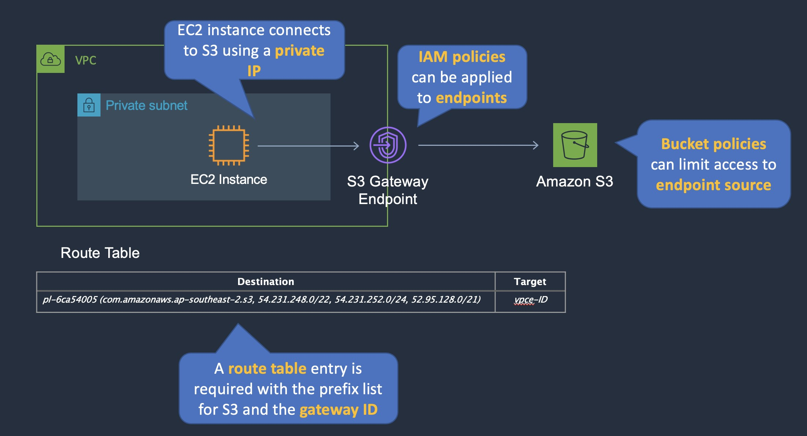

Private access to public services such as Amazon S3 can be achieved by creating a VPC endpoint in the VPC. For S3 this would be a gateway endpoint. The bucket policy can then be configured to restrict access to the S3 endpoint only which will ensure that only services originating from the VPC will be granted access.

Create VPC end point and S3 gateway point
Bucket will only receive access requests from S3 gateway point

EC2 instance will connect via private IP.

### Restrict Access to VPC - Access Points

Amazon S3 access points simplify data access for any AWS service or customer application that stores data in S3. Access points are "named network endpoints" that are attached to buckets that you can use to perform S3 object operations, such as GetObject and PutObject. 

Each access point has distinct permissions and network controls that S3 applies for any request that is made through that access point. Each access point enforces a customized access point policy that works in conjunction with the bucket policy that is attached to the underlying bucket. 

You can configure any access point to accept requests only from a virtual private cloud (VPC) to restrict Amazon S3 data access to a private network. You can also configure custom block public access settings for each access point.

### S3 Object Lock

With S3 Object Lock, you can store objects using a write-once-read-many (WORM) model. Object Lock can help prevent objects from being deleted or overwritten for a fixed amount of time or indefinitely. You can use Object Lock to help meet regulatory requirements that require WORM storage, or to simply add another layer of protection against object changes and deletion.

S3 Object Lock provides two retention modes:

-Governance mode
-Compliance mode

In governance mode, users can't overwrite or delete an object version or alter its lock settings unless they have special permissions. With governance mode, you protect objects against being deleted by most users, but you can still grant some users permission to alter the retention settings or delete the object if necessary. You can also use governance mode to test retention-period settings before creating a compliance-mode retention period.

In compliance mode, a protected object version can't be overwritten or deleted by any user, including the root user in your AWS account. When an object is locked in compliance mode, its retention mode can't be changed, and its retention period can't be shortened. Compliance mode helps ensure that an object version can't be overwritten or deleted for the duration of the retention period.

### Legal Hold And Retention Period
A legal hold doesn't have an associated retention period and remains in effect until removed.
Legal holds are independent from retention periods. As long as the bucket that contains the object has Object Lock enabled, you can place and remove legal holds regardless of whether the specified object version has a retention period set. Placing a legal hold on an object version doesn't affect the retention mode or retention period for that object version.
